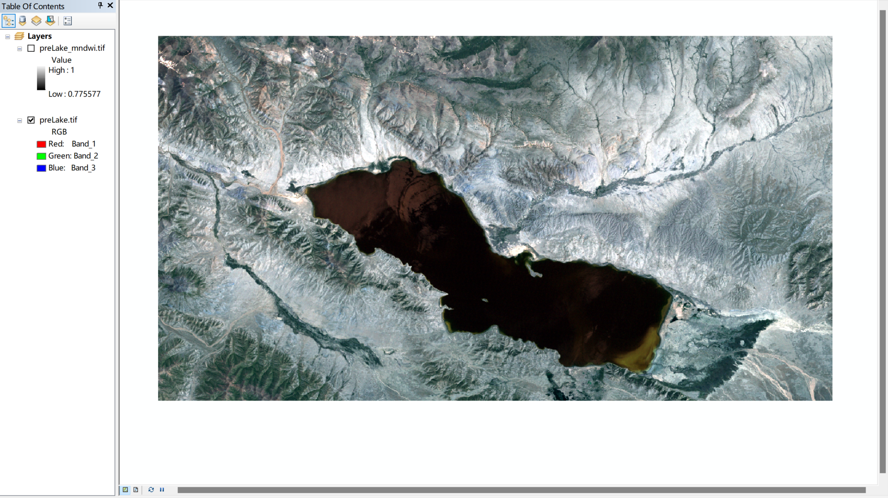
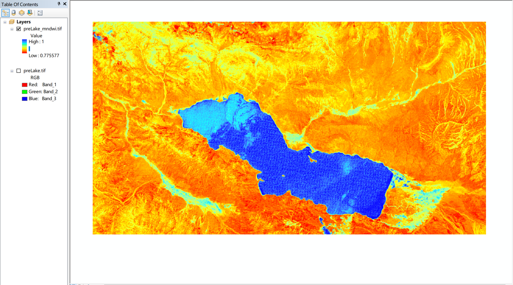
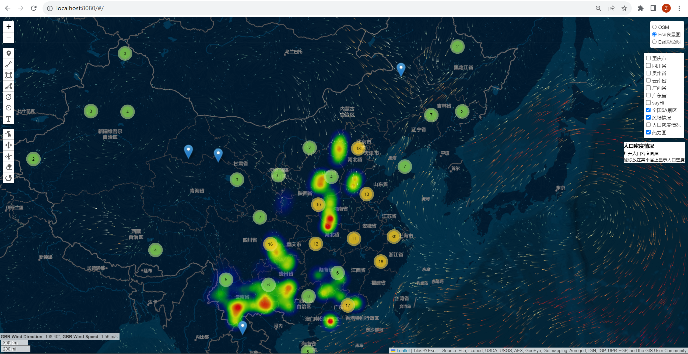

### Rs_MNDWI_Of_Python

利用Gdal计算MNDWI（改进归一化水体指数） 
MNDWI (Modified Normalized Difference Water Index) calculation by Gdal

 

### vueLeafletDemoCode
Leaflet

<video contols width="850" muted autoplay="autoplay" loop="loop">
	<source src="./vueLeafletDemoCode/pic/windy.mp4" / type="video/mp4">
</video>
